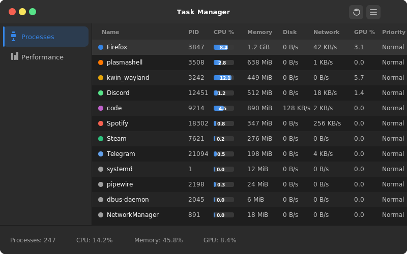

# Task Manager Linux

A lightweight, native system task manager for Linux built with **GTK4** and **Rust**.



## Features

- **Process Management** — View, end, force kill, and reprioritize running processes
- **App Grouping** — Processes grouped by application using X11 window titles, `.desktop` files, and `/proc/comm`
- **Performance Monitoring** — Real-time CPU, memory, disk, network, and GPU graphs
- **GPU Support** — NVIDIA GPU monitoring via NVML
- **DE Restart** — Quick-access button to restart desktop environment components (KDE Plasma, GNOME, XFCE, Cinnamon, MATE)
- **Critical Process Protection** — Warning dialogs prevent accidentally killing system-critical processes like systemd or kwin
- **Global Shortcut** — Register Ctrl+Shift+Esc from inside the app (KDE Plasma)

## Building

Requires Rust and GTK4/libadwaita development libraries.

```bash
# Arch Linux
sudo pacman -S gtk4 libadwaita

# Build
cargo build --release
```

The binary will be at `target/release/task-manager-linux`.

## Keyboard Shortcut

To register Ctrl+Shift+Esc as a global shortcut (KDE Plasma):

1. Launch the app
2. Click the hamburger menu (top right)
3. Click **Install Ctrl+Shift+Esc Shortcut**
4. Log out and back in

Or run the setup script:

```bash
./scripts/setup-shortcut.sh
```

## Tech Stack

- **Rust** with GTK4-rs and libadwaita
- **procfs** for process and system data
- **nvml-wrapper** for NVIDIA GPU monitoring
- **x11rb** for window title resolution
- **flume** for async backend-to-UI communication

## License

MIT
